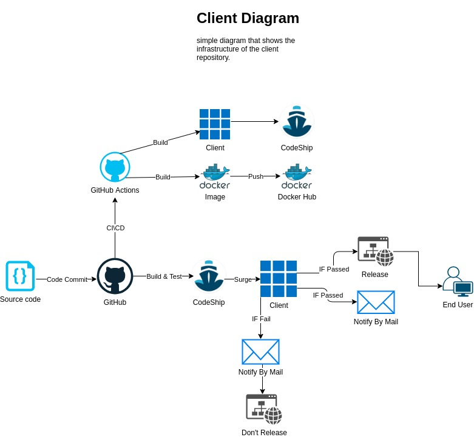

# Algo Solver client-side
  [](https://github.com/AlgoSolver/client/actions/workflows/Build.yml)  [](https://github.com/AlgoSolver/client/actions/workflows/docker.yml)  [](https://app.codeship.com/projects/443997)
## Simple Diagram
<p align="center"> 
  
</p>

## Getting Started
> A list of needed instructions to setup Algo Solver client-side locally.

### Installation
[install.sh](https://github.com/AlgoSolver/client/blob/main/scripts/install.sh)
```sh
./install.sh
```
### Run locally
[run.sh](https://github.com/AlgoSolver/client/blob/main/scripts/run.sh)
```sh
./run.sh
```
### Run as container by docker
[run_docker.sh](https://github.com/AlgoSolver/client/blob/main/scripts/run_docker.sh)
```sh
./run_docker.sh
```
### Production
  [AlgoSolver](https://algosolver.tech/) 
